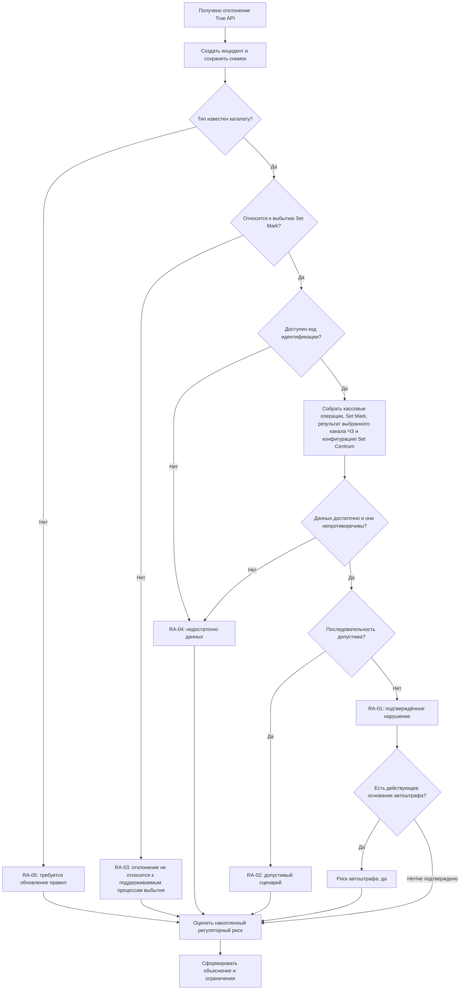

# Decision Model v0.1

**Продукт:** модуль контроля нарушений Set Mark
**Версия:** 0.1
**Статус:** рабочий артефакт для проверки Product Manager
**Ревью:** вынесено на внешнее согласование в ветке `review/product-definition-v0.1`
**Связанные артефакты:** [Domain Model v0.1](domain-model-v0.1.md), [Каталог инцидентов v0.1](incident-catalog-v0.1.md)

## 1. Назначение

Документ описывает последовательность анализа каждого инцидента. Он фиксирует логику решения, необходимые факты, объяснимость и обработку неопределённости. Это не описание программной реализации и не юридическое заключение.

## 2. Вход и выход анализа

### Вход

- снимок отклонения True API;
- код идентификации из отчёта Честного знака;
- продажи, возвраты, отмены и другие доступные кассовые операции по КМ;
- события и результаты проверок Set Mark;
- единственный итоговый результат разрешительной проверки: ответ онлайн ЧЗ либо, при отсутствии связи/ответа, результат fallback-проверки через ЛМ ЧЗ;
- актуальная конфигурация магазина в Set Centrum;
- версия каталога инцидентов;
- версия нормативных правил критичности.

### Выход

- результат анализа `RA-01` — `RA-05`;
- признак отношения к зоне ответственности;
- вид инцидента;
- признак потенциального риска автоштрафа;
- уровень регуляторного риска;
- признак критичности;
- применённые правила;
- объяснение результата;
- перечень отсутствующих или противоречивых данных;
- сравнение актуальной настройки с рекомендуемой, если правило рекомендации утверждено.

## 3. Общий алгоритм



Создание инцидента происходит до любой классификации. Результат анализа не может привести к удалению или сокрытию исходного отклонения.

## 4. Приоритет достоверности

При противоречии источников продукт не должен автоматически объявлять нарушение подтверждённым. Он должен:

1. сохранить все доступные факты;
2. указать противоречие;
3. применить `RA-04: Недостаточно данных`, если правило разрешения противоречия не утверждено;
4. не подменять отсутствующий КМ составным вероятностным ключом;
5. не использовать текущую конфигурацию как доказательство конфигурации в момент операции.

## 5. Базовые правила

### DM-001. Создание инцидента

**Если:** получена запись отклонения True API.
**То:** создать один инцидент и сохранить исходный снимок независимо от последующего результата анализа.

### DM-002. Неизвестный тип отклонения

**Если:** тип/код отклонения отсутствует в утверждённой версии каталога.
**То:** `RA-05`, не определять нарушение и автоштраф без правила, сохранить данные для последующего пересмотра.

### DM-003. Отклонение вне зоны выбытия

**Если:** тип отклонения не относится к процессам выбытия в зоне Set Mark.
**То:** `RA-03: Отклонение не относится к поддерживаемым процессам выбытия`; инцидент остаётся видимым, причина исключения объясняется.

### DM-004. Нет кода идентификации

**Если:** код идентификации из отчёта Честного знака отсутствует или не сопоставляется с данными Set Mark / кассы.
**То:** `RA-04`; GTIN, время, ККТ и магазин не заменяют код идентификации как штатный ключ.

### DM-005. Повторная продажа без возврата

**Если:** отклонение указывает на повторную реализацию; по КМ найдены первая завершённая продажа и последующая завершённая продажа; между ними нет корректного возврата, восстанавливающего допустимость продажи.
**То:** `RA-01`; нарушающей операцией считается последующая продажа; первая продажа отображается как контекст.

### DM-006. Продажа после возврата

**Если:** SetRetail содержит успешно завершённый возврат между первой и повторной продажами одного кода идентификации.
**То:** `RA-02`; успешно завершённого возврата в SetRetail достаточно, чтобы признать повторную продажу допустимой. Дополнительное подтверждение возврата из Честного знака для этого вывода не требуется.

### DM-007. Третья и последующие продажи

**Если:** после первой продажи следуют несколько продаж без корректных возвратов и каждая представлена отдельным отклонением True API.
**То:** каждое отклонение создаёт отдельный инцидент; первая продажа и предыдущие операции входят в контекст.

### DM-008. Онлайн-проверка разрешительного режима

**Если:** онлайн-сервис вернул запрет, а кассовая продажа завершена.
**То:** `RA-01`; источник запрета, решение Set Mark и фактический итог кассовой операции включаются в объяснение. Критичность определяется отдельным нормативным правилом.

### DM-009. Законное использование ЛМ ЧЗ

**Если:** онлайн-сервисы недоступны; использован ЛМ ЧЗ в предусмотренном режиме; его результат допускал продажу; продажа завершена.
**То:** использование офлайн-режима само по себе не подтверждает нарушение и означает, что ритейлер выполнил обязанность по проверке через предусмотренный канал. Если позднее Честный знак зарегистрировал отклонение по этой продаже, создаётся инцидент с результатом, определяемым его видом.

Для отклонения «Продажа товара с истекшим сроком годности»:

- результат анализа — `RA-01`;
- риск автоштрафа — `Нет`, поскольку ритейлер выполнил обязательную проверку через ЛМ ЧЗ и не проигнорировал его запрет;
- регуляторный риск — `Есть`, поскольку отклонение участвует в расчёте накопления однотипных продаж;
- объяснение должно содержать недоступность онлайн ЧЗ, факт и ответ проверки ЛМ ЧЗ, факт продажи и полученное позднее отклонение.

### DM-010. Запрет ЛМ ЧЗ проигнорирован

**Если:** ЛМ ЧЗ вернул запрет, а продажа завершена.
**То:** сведения о продаже должны быть переданы в ГИС МТ и отражены Честным знаком как отклонение в отчёте «Отклонения»; полученная запись True API создаёт инцидент `RA-01`, если достоверно сопоставлены КМ, ответ ЛМ ЧЗ и кассовая операция. Нормативная критичность определяется отдельно.

### DM-011. Продажа без ответа онлайн ЧЗ и ЛМ ЧЗ

**Если:** онлайн ЧЗ не ответил; после этого fallback-проверка через ЛМ ЧЗ также не дала результата; касса всё-таки завершила продажу.
**То:** `RA-01`. Подтверждено нарушение поведения кассы: продажа завершена без разрешающего результата обязательной проверки. В объяснении фиксируются обе неуспешные попытки проверки, отсутствие разрешения и факт завершения продажи.

### DM-012. Текущая конфигурация отличается от рекомендуемой

**Если:** актуальная конфигурация магазина в Set Centrum отличается от утверждённой рекомендуемой настройки для типа инцидента.
**То:** показать расхождение как возможный фактор и рекомендуемое значение; не утверждать, что эта конфигурация действовала в момент операции или была применена на кассе.

### DM-013. Текущая конфигурация соответствует рекомендуемой

**Если:** актуальная конфигурация соответствует рекомендуемой.
**То:** сообщить соответствие; не использовать его как доказательство корректной конфигурации в момент инцидента.

### DM-014. Потенциальный автоштраф

**Если:** подтверждённое нарушение соответствует действующему версионированному нормативному правилу для даты операции, товарной группы, типа операции и вида отклонения.
**То:** `potentialAutoFineRisk = true`, инцидент критический; показать нормативное основание и оговорку, что это оценка риска, а не назначенный штраф.

### DM-015. Накопление однотипных нарушений

**Если:** доля сопоставимых инцидентов одного вида в конкретном объекте розничной продажи за календарный месяц превышает применимый нормативный процент относительно среднемесячного объёма реализации соответствующей продукции.
**То:** установить признак срабатывания индикатора регуляторного риска и повысить критичность. Применять только правило со статусом «вступило в силу»; пороги из проекта нормативного акта хранить и отображать отдельно как прогнозные.

Известные пороги включают:

- продажа без проверки КМ: БАД и антимикробные средства для рук — более 200%, пиво и отдельные слабоалкогольные напитки — более 350%, безалкогольные напитки — более 10%;
- продажа кода, ранее выведенного из оборота: БАД — более 5%; антимикробные средства для рук — более 20% при выполненном запросе сведений о запрете и более 10% без запроса; безалкогольные напитки — более 1% при выполненном запросе и более 5% без запроса.

Процент является порогом индикатора риска, а не допустимым уровнем нарушений.

### DM-016. Объяснимость

**Для каждого результата:** перечислить использованные факты, найденную цепочку операций, источник разрешительного решения, применённую конфигурацию и правило, отсутствующие данные и ограничения.

## 6. Таблица решений: повторная реализация

| Отклонение True API | История операций | Данные проверки | Результат | Нарушающая операция | Критичность |
|---|---|---|---|---|---|
| Повторная реализация | Продажа 1 → Продажа 2 | Достаточны | RA-01 | Продажа 2 | По нормативному правилу |
| Повторная реализация | Продажа 1 → Возврат → Продажа 2 | Достаточны | RA-02 | Нет подтверждённой | Нет по признаку повторности |
| Повторная реализация | Продажа 1 → Продажа 2 → Продажа 3 | Два отдельных отклонения для продаж 2 и 3 | Два инцидента RA-01 | Продажи 2 и 3 | По каждому отдельно |
| Повторная реализация | Найдена только одна продажа | Недостаточны | RA-04 | Не определена | Не определена |
| Повторная реализация | Две продажи, статус возврата противоречив | Противоречивы | RA-04 | Не определена | Не определена |

## 7. Таблица решений: разрешительный режим

Онлайн ЧЗ является первичным каналом. ЛМ ЧЗ вызывается только как fallback при отсутствии связи или ответа онлайн ЧЗ. Для одной продажи эти проверки не выполняются одновременно и формируют один итоговый результат.

| Первичное обращение в онлайн ЧЗ | Fallback в ЛМ ЧЗ | Итоговый результат проверки | Итог кассы | Предварительный результат |
|---|---|---|---|---|
| Ответ получен | Не вызывается | Онлайн ЧЗ разрешил | Продажа | Определяется видом отклонения; сам сценарий допустим |
| Ответ получен | Не вызывается | Онлайн ЧЗ запретил | Продажа | RA-01 |
| Нет связи или ответа | Вызван, ответ получен | ЛМ ЧЗ разрешил | Продажа; позднее ЧЗ зарегистрировал продажу товара с истекшим сроком годности | RA-01; риск автоштрафа — нет; регуляторный риск — есть |
| Нет связи или ответа | Вызван, ответ получен | ЛМ ЧЗ запретил | Продажа | RA-01 |
| Нет связи или ответа | Вызван, ответа нет | Нет результата | Продажа | RA-01: касса завершила продажу без разрешающего результата проверки |
| Ответ получен либо выполнен fallback | В зависимости от результата первичного обращения | Разрешено или запрещено | Продажа не завершена | Инцидент анализируется по True API; состоявшаяся продажа не предполагается без кассового подтверждения |

## 8. Модель критичности

Критичность формируется из двух независимых измерений.

### 8.1. Риск автоштрафа

| Значение | Условие |
|---|---|
| Да | Есть действующее нормативное правило и выполнены все его условия |
| Нет | Подтверждено, что нормативное правило неприменимо |
| Не определён | Основание или необходимые данные отсутствуют |

### 8.2. Регуляторный риск накопления

| Уровень | Рабочее определение v0.1 |
|---|---|
| Не оценён | Для вида отклонения или товарной группы не найдено применимое версионируемое правило либо не подтверждён его статус действия |
| Ниже порога | Фактическая доля не превысила применимый индикатор; нарушение от этого не становится допустимым |
| Порог превышен | Выполнено действующее условие индикатора риска для контрольного мероприятия |
| Прогнозное превышение | Выполнено условие, которое пока содержится в проекте нормативного акта |

Для видов и товарных групп, которым нормативный порог не сопоставлен, продукт показывает фактические количества и динамику без самостоятельного назначения порога.

## 9. Шаблон объяснения

Каждый анализ должен быть способен сформировать объяснение по структуре:

```text
Результат: <RA-код и название>.

Почему:
- True API зарегистрировал: <тип отклонения, дата, идентификатор>;
- по КМ найдена цепочка: <операции>;
- разрешительное решение получено из: <онлайн ЧЗ / ЛМ ЧЗ / нет данных>;
- Set Mark зафиксировал: <результат>;
- касса завершила: <операция или отмена>;
- актуальная конфигурация Set Centrum: <релевантные значения>;
- применено правило: <ID и версия>.

Ограничения:
- <отсутствующие/противоречивые данные>;
- конфигурация взята на момент анализа, а не операции;
- факт применения конфигурации на кассе не проверен.
```

## 10. Версионирование правил

Для воспроизводимости результат должен ссылаться как минимум на:

- версию каталога инцидентов;
- ID и версию правила анализа;
- ID и версию нормативного правила критичности;
- дату и время выполнения анализа;
- версию рекомендуемой конфигурации.

Механизм автоматической переклассификации существующих статических инцидентов при изменении правил пока не определён.

## 11. Явные ограничения

- Правила v0.1 описывают модель, но не полный исполнимый набор.
- Нормативные основания не должны кодироваться по памяти; требуется подтверждённый реестр.
- Известные процентные пороги перенесены, но требуется разделить действующие и проектируемые нормы и дополнить полный перечень.
- Не определён полный набор допустимых последовательностей операций.
- Не подтверждены все поля и статусы онлайн-проверки и ЛМ ЧЗ.
- Не хранится историческая конфигурация.
- Не проверяется доставка конфигурации на кассу.
- Рекомендации ограничены сравнением с утверждёнными настройками; полный каталог рекомендаций не входит в этот артефакт.

## 12. Закрытые вопросы

| ID | Зафиксированное решение |
|---|---|
| OQ-DM-103 | Успешно завершённый возврат в SetRetail является достаточным подтверждением допустимости последующей повторной продажи и приводит к `RA-02`. |

## 13. Открытые вопросы

| ID | Вопрос |
|---|---|
| OQ-DM-101 | Какие официальные типы и коды отклонений входят в область выбытия? |
| OQ-DM-102 | Какие дополнительные результаты последовательных каналов проверки, кроме уже описанных в таблице, необходимо поддержать? |
| OQ-DM-104 | Что делать, если кассовая операция и отклонение True API относятся к одному КМ, но времена существенно расходятся? |
| OQ-DM-105 | Какие из перенесённых процентных порогов уже вступили в силу, а какие остаются проектируемыми? |
| OQ-DM-106 | Должна ли критичность присваиваться отдельному инциденту из-за накопленного риска группы? |
| OQ-DM-107 | Какие нормативные правила автоштрафов действуют по датам и товарным группам? |
| OQ-DM-108 | Требуется ли повторный анализ статической записи при изменении каталога или законодательства? |
| OQ-DM-109 | Какая рекомендуемая конфигурация соответствует каждому поддерживаемому типу инцидента? |
| OQ-DM-110 | Как анализировать отклонение, если текущая конфигурация магазина изменилась после операции? |

> После проверки Product Manager правила должны быть перенесены в канонические требования Product Compiler с зарегистрированными основаниями.
