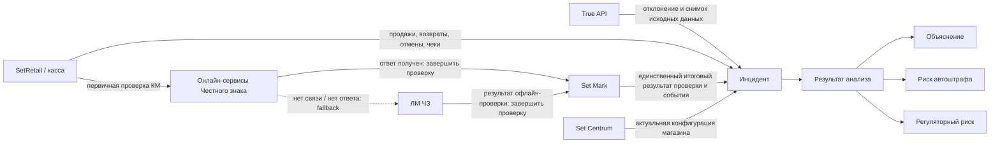

# Domain Model v0.1

**Продукт:** модуль контроля нарушений Set Mark
**Версия:** 0.1
**Статус:** рабочий артефакт для проверки Product Manager
**Ревью:** вынесено на внешнее согласование в ветке `review/product-definition-v0.1`
**Этап Product Compiler:** PRODUCT_DEFINITION (подготовка)
**Связанные артефакты:** [Decision Model v0.1](decision-model-v0.1.md), [Каталог инцидентов v0.1](incident-catalog-v0.1.md)

## 1. Назначение

Документ фиксирует границы предметной области, основные бизнес-сущности, источники данных и согласованные правила первой версии продукта. Он не описывает пользовательский интерфейс, физическую модель данных или техническую реализацию.

Цель продукта — помочь торговой сети свести к нулю нарушения процессов выбытия маркированной продукции и тем самым снизить:

- риск автоматических штрафов;
- регуляторный риск из-за накопления однотипных нарушений;
- риск повторения нарушений, вызванных процессами, интеграциями или настройками.

## 2. Границы продукта

### 2.1. В области ответственности

- отклонения ГИС МТ, полученные через True API;
- операции выбытия маркированной продукции;
- продажа, возврат, отмена и иные доступные кассовые операции, влияющие на законность выбытия;
- проверки кода маркировки в Set Mark;
- онлайн-проверка разрешительного режима в сервисах «Честного знака»;
- офлайн-проверка через Локальный модуль «Честного знака» (ЛМ ЧЗ);
- актуальная конфигурация интеграции с Set Mark и разрешительного режима, заданная для магазина в Set Centrum;
- анализ отклонения, его объяснение и оценка регуляторного риска.

### 2.2. Вне области ответственности v1

- эмиссия кодов маркировки;
- производство и импорт;
- ввод в оборот;
- агрегация и разагрегация;
- складская логистика и перемещения, не связанные с кассовым выбытием;
- полноценное расследование инцидента, workflow, SLA и назначение ответственных;
- проверка фактической доставки и применения конфигурации Set Centrum на кассе;
- хранение исторического снимка конфигурации магазина;
- юридическое подтверждение назначения штрафа;
- проектирование пользовательского интерфейса.

Отклонение вне области ответственности не должно теряться: оно создаёт инцидент с результатом анализа «Отклонение не относится к поддерживаемым процессам выбытия».

## 3. Контекст предметной области



## 4. Центральная сущность

### 4.1. Инцидент

Инцидент — статическая запись v1, создаваемая для каждого отклонения True API. Инцидент хранит неизменяемый снимок исходных данных отклонения и обогащается доступным контекстом из Set Mark, кассовых операций и актуальной конфигурации магазина в Set Centrum.

Инцидент не равен продаже и не равен подтверждённому нарушению:

- продажа может существовать без инцидента;
- инцидент может оказаться допустимым сценарием;
- один код маркировки может участвовать в нескольких операциях и нескольких инцидентах;
- предшествующие операции используются как контекст, но сами не становятся инцидентами, если для них нет отдельного отклонения True API;
- одна запись отклонения True API создаёт один инцидент.

Минимальные смысловые блоки инцидента:

| Блок | Содержание |
|---|---|
| Идентификация | внутренний ID, уникальный ID отклонения True API, код маркировки |
| Исходное отклонение | неизменяемый снимок полученной записи и время импорта |
| Контекст товара | GTIN, товарная группа и доступные товарные атрибуты |
| Контекст операции | организация, магазин, касса/ККТ, чек, дата и время |
| История операций | продажи, возвраты, отмены и другие доступные операции по тому же КМ |
| Проверки | события Set Mark, онлайн-проверка ЧЗ, проверка ЛМ ЧЗ, доступность сервисов |
| Конфигурация | актуальные на момент анализа настройки магазина в Set Centrum |
| Анализ | результат, критичность, риски, применённые правила и объяснение |
| Пользовательские данные v1 | комментарий и, если будет подтверждено отдельно, признак просмотра |

## 5. Сущности и связи

### 5.1. Организация

Организация-клиент, использующая Set Mark. Доступ к True API выполняется от её имени с использованием УКЭП сотрудника этой организации и действующей МЧД.

Связи:

- содержит магазины;
- является владельцем данных инцидентов;
- определяет контур авторизации True API.

### 5.2. Магазин

Организационная единица, на уровне которой в Set Centrum задаются:

- настройки интеграции касс с Set Mark;
- настройки интеграции с «Честным знаком» в рамках разрешительного режима.

Связи:

- принадлежит организации;
- содержит кассы;
- имеет одну актуальную применимую конфигурацию каждого релевантного вида в Set Centrum;
- является контекстом кассовой операции и инцидента.

### 5.3. Касса / ККТ

Точка выполнения операции продажи или возврата. В v1 конфигурация не моделируется как самостоятельное свойство кассы: анализируется конфигурация магазина в Set Centrum.

Касса идентифицируется номером фискального накопителя, действующего в ней. Для определения магазина используется цепочка:

```text
Фискальный номер накопителя из отчёта Честного знака
→ касса в SetRetail / Set Centrum
→ магазин
→ актуальная конфигурация магазина
```

Смена ФН на кассе требует сохранения связи между историческим номером ФН, кассой и магазином. Срок хранения этой связи определяется требованиями к данным.

### 5.4. Код маркировки (КМ)

Точным ключом корреляции данных True API с данными Set Mark и кассы является «код идентификации» из отчёта Честного знака. Product Manager подтвердил, что этого поля достаточно для однозначного сопоставления.

Правила:

- сложный вероятностный составной ключ не используется как замена коду идентификации;
- GTIN, время, магазин, касса и чек используются только для контекста, контроля согласованности и диагностики;
- если код идентификации отсутствует или не удаётся сопоставить, инцидент сохраняется и получает результат «Недостаточно данных»;
- один КМ может иметь последовательность кассовых операций и несколько инцидентов.

### 5.5. Кассовая операция

Фактически выполненное или отменённое действие с КМ в SetRetail. Подтипы, релевантные для v1:

- операции, перечисленные в текущей версии «Каталога инцидентов v0.1».

Перечень каталога является рабочей границей v0.1 и может быть расширен в следующей версии.

Пример допустимой последовательности:

```text
Продажа → Возврат → Повторная продажа
```

Само наличие двух продаж одного КМ не доказывает нарушение: между ними мог быть корректный возврат.

### 5.6. Проверка Set Mark

Событие проверки КМ, включающее доступные запросы, ответы, коды ошибок, решение о допустимости продажи и источник результата проверки.

### 5.7. Проверка разрешительного режима

Проверка возможности продажи КМ по правилам разрешительного режима. Результат может быть получен:

- онлайн от сервисов «Честного знака» при первичном обращении;
- офлайн от ЛМ ЧЗ только как fallback, если онлайн-сервисы недоступны или не ответили;
- из иного предусмотренного нормативами и конфигурацией сценария — перечень требует уточнения.

Одновременная онлайн-проверка и проверка через ЛМ ЧЗ для одной продажи невозможна. Анализ использует единственный итоговый результат выбранного последовательного канала и должен различать его источник.

### 5.8. Локальный модуль «Честного знака» (ЛМ ЧЗ)

Источник офлайн-решения при недоступности сервисов «Честного знака». Использование ЛМ ЧЗ является законным резервным сценарием и само по себе не является нарушением.

В v1 используется только результат проверки ЛМ ЧЗ, полученный SetRetail / Set Mark непосредственно в ходе продажи. В составе сохранённого результата и контекста операции анализируются:

- факте обращения к ЛМ ЧЗ;
- результате проверки;
- времени проверки, если оно входит в результат или контекст продажи;
- ошибке или отсутствии ответа;
- решении кассы после ответа.

Продукт не обращается к API ЛМ ЧЗ за дополнительными или историческими сведениями. Описание API может быть изучено отдельно после его предоставления, но это не расширяет границы v1 автоматически.

Отдельный контроль длительности автономной работы не требуется: согласно принятому ограничению, ЛМ ЧЗ перестаёт отвечать после 72 часов офлайн. Для v1 этого защитного механизма достаточно.

### 5.9. Конфигурация магазина в Set Centrum

Актуальные настройки интеграции с Set Mark и разрешительного режима, сохранённые на уровне магазина.

Ограничения v1:

- используется состояние конфигурации на момент анализа инцидента;
- исторический снимок не сохраняется;
- фактическая доставка и применение конфигурации на кассе не проверяются;
- выводы должны явно сообщать об этом ограничении;
- конфигурация сопоставляется с согласованной рекомендуемой настройкой.

### 5.10. Отклонение True API

Исходная запись регулятора. Каждое полученное отклонение создаёт инцидент и должно получить явный результат обработки. Исходные данные сохраняются в виде снимка для воспроизводимости.

### 5.11. Результат анализа

Классификация инцидента после применения правил:

| Код | Результат | Смысл |
|---|---|---|
| RA-01 | Подтверждённое нарушение | Доступные факты подтверждают нарушение процесса выбытия |
| RA-02 | Допустимый сценарий | Отклонение объясняется корректной последовательностью операций |
| RA-03 | Отклонение не относится к поддерживаемым процессам выбытия | Тип отклонения получен и сохранён, но его анализ находится вне продуктовой границы Set Mark |
| RA-04 | Недостаточно данных | Данных недостаточно для достоверного вывода |
| RA-05 | Требуется обновление правил анализа | Тип отклонения получен, но правило его анализа ещё не утверждено или не реализовано |

### 5.12. Критичность и риск

Результат анализа, риск автоштрафа и накопленный регуляторный риск — независимые характеристики инцидента. `RA-01` не означает автоматически наличие риска автоштрафа.

Инцидент требует особого внимания, если выполняется хотя бы одно условие:

- есть подтверждённый потенциальный риск автоматического штрафа;
- инцидент входит в накопление однотипных нарушений, повышающее регуляторный риск;
- недостаток данных не позволяет исключить высокий риск — правило порога требует отдельного решения.

До подтверждения нормативного основания продукт использует формулировку «потенциальный риск автоштрафа» и не утверждает, что штраф назначен или обязательно будет назначен.

Пример независимой классификации:

| Ситуация | Результат анализа | Риск автоштрафа | Регуляторный риск |
|---|---|---|---|
| Онлайн ЧЗ недоступен; ритейлер выполнил обязательную проверку через ЛМ ЧЗ; ЛМ ЧЗ разрешил продажу; позднее Честный знак зарегистрировал отклонение «Продажа товара с истекшим сроком годности» | `RA-01` | Нет: обязательство по проверке выполнено через предусмотренный офлайн-канал и запрет ЛМ ЧЗ не был проигнорирован | Есть: продажа остаётся отклонением и учитывается при накоплении однотипных случаев |

В объяснении такого инцидента необходимо явно показать:

- почему установлен `RA-01`;
- что проверка была выполнена через ЛМ ЧЗ из-за отсутствия онлайн-связи;
- какой ответ вернул ЛМ ЧЗ;
- почему риск автоштрафа отсутствует;
- в каком регуляторном показателе учитывается отклонение.

### 5.13. Объяснение результата

Обязательная часть результата анализа. Содержит:

- какие факты были использованы;
- какая последовательность операций обнаружена;
- какие ответы проверок и настройки учтены;
- какое правило применено;
- почему получен именно этот результат;
- какие данные отсутствовали;
- какое ограничение могло повлиять на достоверность.

### 5.14. Политика хранения

Инцидент хранится как единый объект вместе с неизменяемым снимком исходного отклонения Честного знака, результатом анализа, объяснением и сохранённым контекстом обогащения.

Срок хранения задаётся пользователем торговой сети в настройках продукта. Значение по умолчанию — **60 календарных дней**.

Настройка применяется одновременно к исходным инцидентам и построенной по ним агрегированной статистике. Отдельный срок хранения агрегатов не задаётся.

После истечения настроенного срока инцидент, связанные с ним исходный снимок, результат анализа, объяснение, сохранённый контекст обогащения и относящиеся к истёкшему периоду агрегированные показатели безвозвратно удаляются. Архивирование этих данных в v1 не выполняется.

## 6. Инварианты v1

1. Каждое отклонение True API создаёт ровно один инцидент.
2. Ни одно отклонение не отбрасывается молча.
3. Исходный снимок отклонения True API сохраняется.
4. Основная корреляция выполняется по коду идентификации из отчёта Честного знака.
5. История операций по КМ используется как контекст анализа.
6. Продажа → возврат → повторная продажа не считается нарушением только на основании повторности продаж.
7. Использование ЛМ ЧЗ при предусмотренных условиях не считается нарушением само по себе.
8. Для конфигурационного анализа используется актуальная конфигурация магазина в Set Centrum.
9. Историческая конфигурация и факт её применения на кассе в v1 не подтверждаются.
10. Любой вывод должен быть объясним и трассируем до фактов и правила.
11. Критичность по автоштрафам должна иметь нормативное основание.
12. Повторяемость однотипных инцидентов анализируется как отдельный регуляторный риск.
13. `RA-01`, риск автоштрафа и регуляторный риск вычисляются независимо.
14. Законная офлайн-проверка через ЛМ ЧЗ может исключить риск автоштрафа, но не удаляет отклонение Честного знака и не исключает его из накопленного регуляторного риска.
15. Одна кассовая операция может породить несколько отклонений разных видов; каждая запись True API создаёт отдельный инцидент.
16. Для v0.1 перечень поддерживаемых операций выбытия ограничен операциями из «Каталога инцидентов v0.1».
17. Рекомендуемую конфигурацию магазина пользователь торговой сети задаёт вручную.
18. Признак «Новый / Просмотрен» в v1 не используется.
19. Магазин определяется через номер фискального накопителя из отчёта Честного знака и связь этого номера с кассой в справочниках SetRetail / Set Centrum.
20. Проверка разрешительного режима выполняется последовательно: сначала онлайн ЧЗ; только при отсутствии связи или ответа — fallback в ЛМ ЧЗ. Одновременная проверка в обоих каналах невозможна.
21. Срок хранения инцидента и связанных с ним данных настраивается; значение по умолчанию составляет 60 календарных дней.
22. После окончания срока хранения инцидент и связанные с ним данные безвозвратно удаляются; архив инцидентов в v1 не ведётся.
23. Та же настройка срока хранения применяется к агрегированной статистике; по умолчанию агрегаты также хранятся 60 календарных дней и затем удаляются.

## 7. Явные ограничения

- Документ не подтверждает полный перечень видов отклонений True API.
- Не определены официальные коды и точные поля всех отклонений.
- Перечень операций выбытия временно ограничен текущим составом «Каталога инцидентов v0.1».
- Из ЛМ ЧЗ используются только результаты, сохранённые в ходе продажи; дополнительные данные через API не запрашиваются.
- Продукт не контролирует собственным таймером 72-часовой предел автономной работы ЛМ ЧЗ.
- Рекомендуемая конфигурация вводится пользователем вручную; автоматический расчёт или централизованная поставка рекомендаций не входят в v1.
- Признак просмотра инцидента отсутствует в v1.
- Текущая конфигурация может отличаться от конфигурации в момент операции.
- Конфигурация Set Centrum может не совпадать с фактически применённой на кассе.
- Нормативная классификация автоштрафов и контрольных рисков меняется во времени и требует версионируемых оснований.
- v1 не содержит процесса устранения, назначения ответственных и контроля исполнения.

## 8. Закрытые вопросы

| ID | Зафиксированное решение |
|---|---|
| OQ-DM-001 | «Код идентификации» из отчёта Честного знака считается достаточным точным ключом для сопоставления с Set Mark и кассовыми данными. |
| OQ-DM-002 | Да, одна кассовая операция может породить несколько отклонений разных видов. Каждая запись отклонения создаёт отдельный инцидент. |
| OQ-DM-003 | В v0.1 используется текущий перечень операций из «Каталога инцидентов v0.1». |
| OQ-DM-004 | Используется только результат проверки ЛМ ЧЗ, полученный кассовым контуром при продаже. Дополнительные данные из ЛМ ЧЗ не запрашиваются. |
| OQ-DM-005 | Отдельная проверка срока автономной работы в v1 не требуется: ЛМ ЧЗ перестаёт отвечать после 72 часов офлайн. |
| OQ-DM-006 | Рекомендуемую конфигурацию вручную задаёт пользователь торговой сети. |
| OQ-DM-007 | Признак «Новый / Просмотрен» в первой версии не нужен. |
| OQ-DM-008 | Процентные индикаторы берутся из предоставленного нормативного документа; известные значения уже перенесены в Каталог инцидентов и Decision Model. |
| OQ-DM-009 | Инцидент, исходный снимок, результат анализа, объяснение и сохранённый контекст обогащения хранятся в течение настраиваемого срока; значение по умолчанию — 60 календарных дней. |
| OQ-DM-010 | Магазин определяется через номер ФН из чека операции: отчёт Честного знака содержит этот номер, а SetRetail / Set Centrum связывает его с кассой и магазином. |
| OQ-DM-011 | После истечения настроенного срока инцидент и все связанные с ним данные безвозвратно удаляются; архивирование не выполняется. |
| OQ-DM-012 | Агрегированная статистика подчиняется той же настройке срока хранения, что и инциденты; значение по умолчанию — 60 календарных дней, после чего агрегаты удаляются. |

## 9. Открытые вопросы

На текущем уровне детализации Domain Model v0.1 открытых продуктовых вопросов нет. Новые вопросы могут появиться после внешнего ревью или при переносе модели в канонические требования Product Compiler.

## 10. Согласованные продуктовые решения

| ID | Решение |
|---|---|
| PM-001 | Центральная сущность — Инцидент |
| PM-002 | Область ответственности ограничена процессами выбытия маркированной продукции |
| PM-003 | Инцидент v1 — статическая запись без workflow |
| PM-004 | Анализ использует актуальную конфигурацию, а не исторический снимок |
| PM-005 | Продукт объясняет причины и показывает рекомендуемую настройку |
| PM-006 | Цель — снижение совокупного регуляторного риска и стремление к нулю нарушений |
| PM-007 | Каждое отклонение True API импортируется и анализируется |
| PM-008 | Источники анализа: True API, Set Mark, SetRetail/касса и Set Centrum |
| PM-009 | Настройки интеграций задаются в Set Centrum на уровне магазина |
| PM-010 | v1 анализирует конфигурацию Set Centrum без проверки её применения на кассе |
| PM-011 | Каждый результат анализа должен быть объясним |
| PM-012 | Одна кассовая операция может породить несколько отклонений и отдельных инцидентов |
| PM-013 | Перечень операций выбытия v0.1 определяется текущим Каталогом инцидентов |
| PM-014 | Из ЛМ ЧЗ используются только результаты проверки, полученные в ходе продажи |
| PM-015 | Отдельный контроль 72 часов офлайн в v1 не требуется |
| PM-016 | Рекомендуемую конфигурацию вручную задаёт пользователь торговой сети |
| PM-017 | Признак «Новый / Просмотрен» не входит в v1 |
| PM-018 | Процентные индикаторы риска берутся из предоставленного нормативного документа |
| PM-019 | Магазин сопоставляется через номер ФН из отчёта Честного знака и справочники касс |
| PM-020 | Онлайн ЧЗ и ЛМ ЧЗ образуют последовательную схему primary/fallback и не проверяют одну продажу одновременно |
| PM-021 | Код идентификации из отчёта Честного знака является достаточным точным ключом корреляции |
| PM-022 | Срок хранения инцидента настраивается пользователем; значение по умолчанию — 60 календарных дней |
| PM-023 | После окончания срока хранения инцидент и связанные данные безвозвратно удаляются без архивирования |
| PM-024 | Агрегированная статистика хранится и удаляется по той же настройке, что и исходные инциденты |

## 11. Подтверждение поля отчёта Честного знака

Официальная инструкция ГИС МТ по функциональности «Статистика отклонений» перечисляет среди полей выгрузки:

- регистрационный номер ККТ из чека;
- фискальный номер накопителя из чека операции;
- адрес места фиксации;
- идентификатор ФИАС.

Для v1 каноническим ключом определения кассы и магазина выбран фискальный номер накопителя. Остальные поля используются для проверки согласованности и диагностики.

Источник: [Инструкция по работе с функциональностью «Статистика отклонений» в ГИС МТ](https://docs.crpt.ru/gismt/%D0%98%D0%BD%D1%81%D1%82%D1%80%D1%83%D0%BA%D1%86%D0%B8%D1%8F_%D0%BF%D0%BE_%D1%80%D0%B0%D0%B1%D0%BE%D1%82%D0%B5_%D1%81_%D0%A1%D0%A3%D0%9D/).

> Формальная регистрация этих решений в evidence register Product Compiler и перенос в канонические требования выполняются отдельно после проверки артефактов Product Manager.
