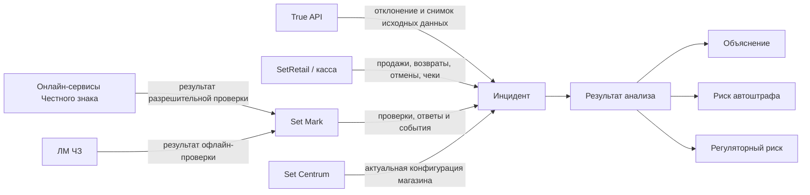

# Domain Model v0.1

**Продукт:** модуль контроля нарушений Set Mark
**Версия:** 0.1
**Статус:** рабочий артефакт для проверки Product Manager
**Этап Product Compiler:** PRODUCT_DEFINITION (подготовка)
**Связанные артефакты:** [Decision Model v0.1](decision-model-v0.1.md), [Каталог инцидентов v0.1](incident-catalog-v0.1.md)

## 1. Назначение

Документ фиксирует границы предметной области, основные бизнес-сущности, источники данных и согласованные правила первой версии продукта. Он не описывает пользовательский интерфейс, физическую модель данных или техническую реализацию.

Цель продукта — помочь торговой сети свести к нулю нарушения процессов выбытия маркированной продукции и тем самым снизить:

- риск автоматических штрафов;
- регуляторный риск из-за накопления однотипных нарушений;
- риск повторения нарушений, вызванных процессами, интеграциями или настройками.

## 2. Границы продукта

### 2.1. В области ответственности

- отклонения ГИС МТ, полученные через True API;
- операции выбытия маркированной продукции;
- продажа, возврат, отмена и иные доступные кассовые операции, влияющие на законность выбытия;
- проверки кода маркировки в Set Mark;
- онлайн-проверка разрешительного режима в сервисах «Честного знака»;
- офлайн-проверка через Локальный модуль «Честного знака» (ЛМ ЧЗ);
- актуальная конфигурация интеграции с Set Mark и разрешительного режима, заданная для магазина в Set Centrum;
- анализ отклонения, его объяснение и оценка регуляторного риска.

### 2.2. Вне области ответственности v1

- эмиссия кодов маркировки;
- производство и импорт;
- ввод в оборот;
- агрегация и разагрегация;
- складская логистика и перемещения, не связанные с кассовым выбытием;
- полноценное расследование инцидента, workflow, SLA и назначение ответственных;
- проверка фактической доставки и применения конфигурации Set Centrum на кассе;
- хранение исторического снимка конфигурации магазина;
- юридическое подтверждение назначения штрафа;
- проектирование пользовательского интерфейса.

Отклонение вне области ответственности не должно теряться: оно создаёт инцидент с результатом анализа «Вне области ответственности Set Mark».

## 3. Контекст предметной области



## 4. Центральная сущность

### 4.1. Инцидент

Инцидент — статическая запись v1, создаваемая для каждого отклонения True API. Инцидент хранит неизменяемый снимок исходных данных отклонения и обогащается доступным контекстом из Set Mark, кассовых операций и актуальной конфигурации магазина в Set Centrum.

Инцидент не равен продаже и не равен подтверждённому нарушению:

- продажа может существовать без инцидента;
- инцидент может оказаться допустимым сценарием;
- один код маркировки может участвовать в нескольких операциях и нескольких инцидентах;
- предшествующие операции используются как контекст, но сами не становятся инцидентами, если для них нет отдельного отклонения True API;
- одна запись отклонения True API создаёт один инцидент.

Минимальные смысловые блоки инцидента:

| Блок | Содержание |
|---|---|
| Идентификация | внутренний ID, уникальный ID отклонения True API, код маркировки |
| Исходное отклонение | неизменяемый снимок полученной записи и время импорта |
| Контекст товара | GTIN, товарная группа и доступные товарные атрибуты |
| Контекст операции | организация, магазин, касса/ККТ, чек, дата и время |
| История операций | продажи, возвраты, отмены и другие доступные операции по тому же КМ |
| Проверки | события Set Mark, онлайн-проверка ЧЗ, проверка ЛМ ЧЗ, доступность сервисов |
| Конфигурация | актуальные на момент анализа настройки магазина в Set Centrum |
| Анализ | результат, критичность, риски, применённые правила и объяснение |
| Пользовательские данные v1 | комментарий и, если будет подтверждено отдельно, признак просмотра |

## 5. Сущности и связи

### 5.1. Организация

Организация-клиент, использующая Set Mark. Доступ к True API выполняется от её имени с использованием УКЭП сотрудника этой организации и действующей МЧД.

Связи:

- содержит магазины;
- является владельцем данных инцидентов;
- определяет контур авторизации True API.

### 5.2. Магазин

Организационная единица, на уровне которой в Set Centrum задаются:

- настройки интеграции касс с Set Mark;
- настройки интеграции с «Честным знаком» в рамках разрешительного режима.

Связи:

- принадлежит организации;
- содержит кассы;
- имеет одну актуальную применимую конфигурацию каждого релевантного вида в Set Centrum;
- является контекстом кассовой операции и инцидента.

### 5.3. Касса / ККТ

Точка выполнения операции продажи или возврата. В v1 конфигурация не моделируется как самостоятельное свойство кассы: анализируется конфигурация магазина в Set Centrum.

### 5.4. Код маркировки (КМ)

Обязательный ключ корреляции данных True API с данными Set Mark и кассы.

Правила:

- сложный вероятностный составной ключ не используется как штатная замена КМ;
- GTIN, время, магазин, касса и чек используются для контекста и диагностики;
- если полный КМ отсутствует или не удаётся сопоставить, инцидент сохраняется и получает результат «Недостаточно данных»;
- один КМ может иметь последовательность кассовых операций и несколько инцидентов.

### 5.5. Кассовая операция

Фактически выполненное или отменённое действие с КМ в SetRetail. Подтипы, релевантные для v1:

- продажа;
- возврат;
- отмена позиции или чека;
- иные операции выбытия — после подтверждения конкретного перечня.

Пример допустимой последовательности:

```text
Продажа → Возврат → Повторная продажа
```

Само наличие двух продаж одного КМ не доказывает нарушение: между ними мог быть корректный возврат.

### 5.6. Проверка Set Mark

Событие проверки КМ, включающее доступные запросы, ответы, коды ошибок, решение о допустимости продажи и источник результата проверки.

### 5.7. Проверка разрешительного режима

Проверка возможности продажи КМ по правилам разрешительного режима. Результат может быть получен:

- онлайн от сервисов «Честного знака»;
- офлайн от ЛМ ЧЗ при недоступности онлайн-сервисов;
- из иного предусмотренного нормативами и конфигурацией сценария — перечень требует уточнения.

Источник решения должен быть различим в анализе.

### 5.8. Локальный модуль «Честного знака» (ЛМ ЧЗ)

Источник офлайн-решения при недоступности сервисов «Честного знака». Использование ЛМ ЧЗ является законным резервным сценарием и само по себе не является нарушением.

Для анализа необходимы доступные сведения о:

- факте обращения к ЛМ ЧЗ;
- результате проверки;
- времени и актуальности локальных данных;
- ошибке или недоступности ЛМ ЧЗ;
- решении кассы после ответа.

Точный состав доступных полей и нормативные условия офлайн-продажи остаются открытыми.

### 5.9. Конфигурация магазина в Set Centrum

Актуальные настройки интеграции с Set Mark и разрешительного режима, сохранённые на уровне магазина.

Ограничения v1:

- используется состояние конфигурации на момент анализа инцидента;
- исторический снимок не сохраняется;
- фактическая доставка и применение конфигурации на кассе не проверяются;
- выводы должны явно сообщать об этом ограничении;
- конфигурация сопоставляется с согласованной рекомендуемой настройкой.

### 5.10. Отклонение True API

Исходная запись регулятора. Каждое полученное отклонение создаёт инцидент и должно получить явный результат обработки. Исходные данные сохраняются в виде снимка для воспроизводимости.

### 5.11. Результат анализа

Классификация инцидента после применения правил:

| Код | Результат | Смысл |
|---|---|---|
| RA-01 | Подтверждённое нарушение | Доступные факты подтверждают нарушение процесса выбытия |
| RA-02 | Допустимый сценарий | Отклонение объясняется корректной последовательностью операций |
| RA-03 | Вне области ответственности Set Mark | Отклонение не относится к поддерживаемым процессам выбытия |
| RA-04 | Недостаточно данных | Данных недостаточно для достоверного вывода |
| RA-05 | Требуется обновление правил анализа | Тип отклонения получен, но правило его анализа ещё не утверждено или не реализовано |

### 5.12. Критичность и риск

Критичность — характеристика инцидента, а не статус его обработки.

Инцидент требует особого внимания, если выполняется хотя бы одно условие:

- есть подтверждённый потенциальный риск автоматического штрафа;
- инцидент входит в накопление однотипных нарушений, повышающее регуляторный риск;
- недостаток данных не позволяет исключить высокий риск — правило порога требует отдельного решения.

До подтверждения нормативного основания продукт использует формулировку «потенциальный риск автоштрафа» и не утверждает, что штраф назначен или обязательно будет назначен.

### 5.13. Объяснение результата

Обязательная часть результата анализа. Содержит:

- какие факты были использованы;
- какая последовательность операций обнаружена;
- какие ответы проверок и настройки учтены;
- какое правило применено;
- почему получен именно этот результат;
- какие данные отсутствовали;
- какое ограничение могло повлиять на достоверность.

## 6. Инварианты v1

1. Каждое отклонение True API создаёт ровно один инцидент.
2. Ни одно отклонение не отбрасывается молча.
3. Исходный снимок отклонения True API сохраняется.
4. Основная корреляция выполняется по полному коду маркировки.
5. История операций по КМ используется как контекст анализа.
6. Продажа → возврат → повторная продажа не считается нарушением только на основании повторности продаж.
7. Использование ЛМ ЧЗ при предусмотренных условиях не считается нарушением само по себе.
8. Для конфигурационного анализа используется актуальная конфигурация магазина в Set Centrum.
9. Историческая конфигурация и факт её применения на кассе в v1 не подтверждаются.
10. Любой вывод должен быть объясним и трассируем до фактов и правила.
11. Критичность по автоштрафам должна иметь нормативное основание.
12. Повторяемость однотипных инцидентов анализируется как отдельный регуляторный риск.

## 7. Явные ограничения

- Документ не подтверждает полный перечень видов отклонений True API.
- Не определены официальные коды и точные поля всех отклонений.
- Не подтверждена доступность полного КМ во всех необходимых выгрузках True API.
- Не определён полный набор кассовых операций, достаточный для каждого правила.
- Текущая конфигурация может отличаться от конфигурации в момент операции.
- Конфигурация Set Centrum может не совпадать с фактически применённой на кассе.
- Нормативная классификация автоштрафов и контрольных рисков меняется во времени и требует версионируемых оснований.
- v1 не содержит процесса устранения, назначения ответственных и контроля исполнения.

## 8. Открытые вопросы

| ID | Вопрос | Влияние |
|---|---|---|
| OQ-DM-001 | Какой официальный метод/поле True API предоставляет полный КМ для каждого поддерживаемого отклонения? | Корреляция |
| OQ-DM-002 | Может ли одна кассовая операция породить несколько отклонений разных видов? | Кардинальность «операция — инцидент» |
| OQ-DM-003 | Каков полный перечень операций выбытия в зоне ответственности Set Mark? | Границы продукта |
| OQ-DM-004 | Какие данные ЛМ ЧЗ доступны Set Mark и SetRetail для последующего анализа? | Объяснимость офлайн-сценария |
| OQ-DM-005 | Какие нормативные условия и сроки допустимости офлайн-продажи должны проверяться? | Классификация |
| OQ-DM-006 | Как определяется рекомендуемая конфигурация для магазина с учётом товарных групп и версии SetRetail? | Рекомендации |
| OQ-DM-007 | Нужен ли в v1 признак «Новый / Просмотрен» или только комментарий? | Минимальное изменение статической записи |
| OQ-DM-008 | Какие процентные индикаторы риска уже вступили в силу, какие остаются проектируемыми и как они сопоставляются с видами отклонений? | Критичность |
| OQ-DM-009 | Какие поля исходного отклонения и обогащения подлежат хранению и каков срок хранения? | Данные и аудит |
| OQ-DM-010 | Как однозначно сопоставляются магазин и ККТ из True API со справочниками SetRetail/Set Centrum? | Обогащение |

## 9. Согласованные продуктовые решения

| ID | Решение |
|---|---|
| PM-001 | Центральная сущность — Инцидент |
| PM-002 | Область ответственности ограничена процессами выбытия маркированной продукции |
| PM-003 | Инцидент v1 — статическая запись без workflow |
| PM-004 | Анализ использует актуальную конфигурацию, а не исторический снимок |
| PM-005 | Продукт объясняет причины и показывает рекомендуемую настройку |
| PM-006 | Цель — снижение совокупного регуляторного риска и стремление к нулю нарушений |
| PM-007 | Каждое отклонение True API импортируется и анализируется |
| PM-008 | Источники анализа: True API, Set Mark, SetRetail/касса и Set Centrum |
| PM-009 | Настройки интеграций задаются в Set Centrum на уровне магазина |
| PM-010 | v1 анализирует конфигурацию Set Centrum без проверки её применения на кассе |
| PM-011 | Каждый результат анализа должен быть объясним |

> Формальная регистрация этих решений в evidence register Product Compiler и перенос в канонические требования выполняются отдельно после проверки артефактов Product Manager.
